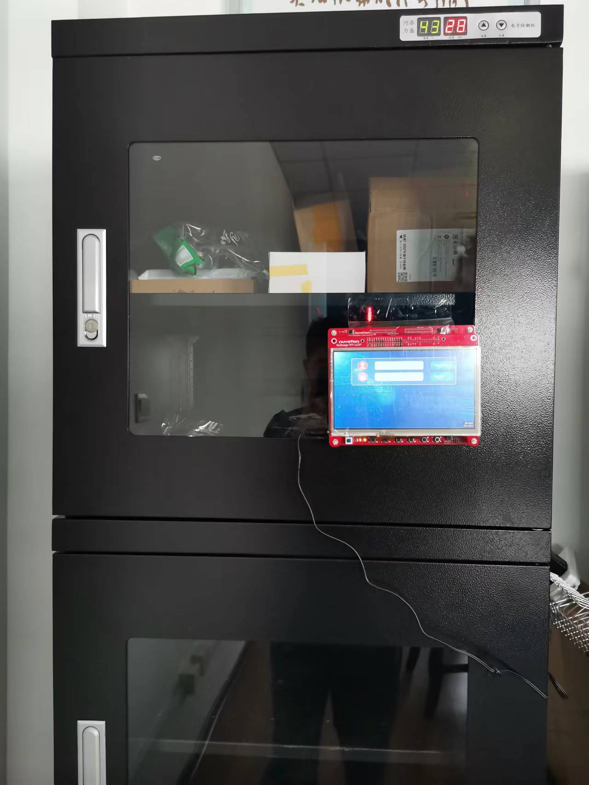
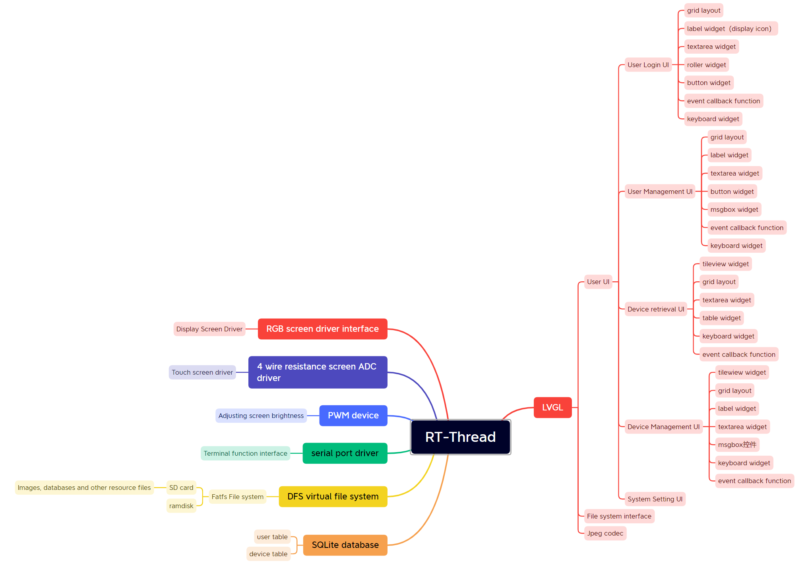
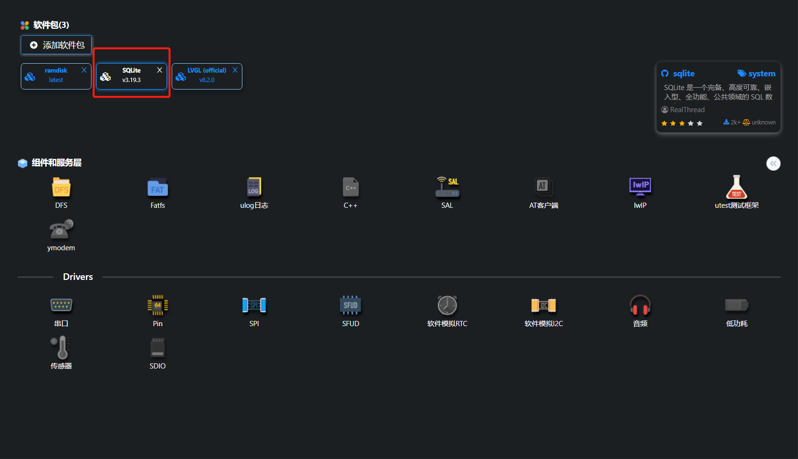
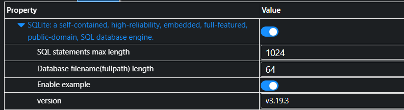
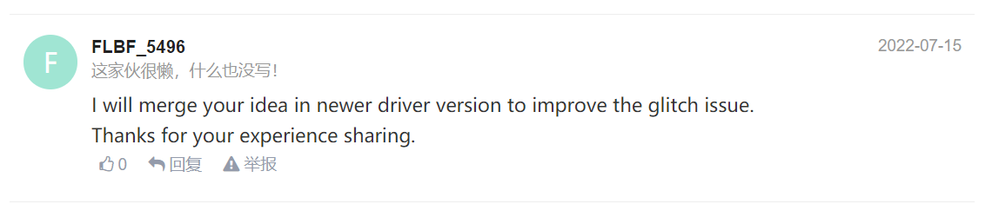

# ComponentsLib

#### Description

Portable device inventory management system based on Nuvoton N9H30 hardware platform and RTThread+LVGL software platform. LVGL Embedded GUI Challenge work.

The following figure shows the imagined end-use scenario. Fix the system next to the device cabinet to facilitate device management and search. (Since the development has not been completed, it is temporarily cemented to indicate)



#### System architecture

The following is the main system frame diagram.



#### Major functions have been implemented

- UI based on LVGL
  
  - User Login UI
  
  - User Management UI
  
  - Device Management UI
  
  - System Setting UI
  
  - Device retrieval UI

- File system for storing images and database resource files

- Bind the DFS virtual file system to LVGL's file manipulation interface

- Register JPEG software decoder to LVGL to load pictures from SD card

- SQLite database management
  
  - The users table
  
  - The device table

- Adjust the brightness of the display backlight, automatically extinguish the screen when there is no operation, and wake up when touch the touch screen

- Richer database manipulation functionality via terminal serial port commands (not linked to UI)

- Through the terminal serial port command to achieve the Excel file import database function

#### Features not yet completed

- More abundant and reasonable user management functions
  
  - Authorize users to register over the network
  
  - User login and operation logs

- Richer device management functions
  
  - Remote management over the network

- Optimize the UI to make it more efficient and elegant

- Added Chinese language support

- ...

#### Documentation of development processes and key points

1. Create a project based on RT-Thread
   
   See my previous test post on the RT-Thread forum：[RT-Thread-N9H30开发板开箱测试RT-Thread问答社区 - RT-Thread](https://club.rt-thread.org/ask/article/9a1b494513c87d83.html)

2. Create your own`user_gui`source and header files. And the user UI interface code interface, added to the `lvgl_thread` function in `lv_demo.c`. Mask all DEMO macros.
   
   ```c
   static void lvgl_thread(void *parameter)
   {
   #if LV_USE_DEMO_BENCHMARK
     extern void lv_demo_benchmark(void);
     lv_demo_benchmark();
   #endif
   #if LV_USE_DEMO_WIDGETS
     extern void lv_demo_widgets(void);
   #endif
   #if LV_USE_DEMO_MUSIC || LV_USE_DEMO_RTT_MUSIC
     extern void lv_demo_music(void);
     lv_demo_music();
   #endif
     rt_thread_delay(1000);
     user_gui_init();      //用户代码接口
     while (1)
     {
         lv_task_handler();
         rt_thread_mdelay(1);
     }
   }
   ```

3. Call `lv_fs_posix_init()` in `user_gui_init()` to bind the file system interface
   
   The development kit provided by RT-Thread has been adapted to the DFS virtual file system. It only needs to be connected to LVGL's file manipulation interface.

4. Call `lv_split_jpeg_init()` in `user_gui_init()` to register the JPEG soft decoder to LVGL
   
   The `decoder_info`, `decoder_open`, `decoder_close`, and `decoder_read_line` functions in `lv_sjpg.c` are linked to LVGL's decoder list. When loading a JPEG image in a file system, LVGL automatically looks for a matching decoder to decode it. Also, note that under LVGL's filesystem interface, the file path is preceded by "S:". Of course, this identifier can be modified by the `#define CONFIG_LV_FS_POSIX_LETTER 's'` macro definition inside `lv_conf.h`, the default is "S".

5. Added SQLite database support
   
   First, in RT-Thread Studio, search for and add the SQLite package.
   
   
   
   The configuration is as follows:
   
   
   
   If Example is turned on, the example code will be added to the project. Then you can imitate the routine code to achieve their own specific functions. I have created a new `sysdatabase` source file and header file to hold the database related operation code. Implement the following `create_sysdb_table()` function. It is called at the beginning of `user_gui_init()`. Check whether the database file exists. If yes, check whether the corresponding database table exists. If not, create the database and set up the required database tables.

```c
void create_sysdb_table(void)
{
  int fd = 0, res;
  db_set_name(SYSDB_NAME);
  fd = open(db_get_name(), O_RDONLY);
  if (fd < 0)
  {
      LOG_I("database:%s cant open,wile create it!\r\n",db_get_name());
      /* there is not the .db file.create db and table */
      sprintf(sql_str,"CREATE TABLE %s(id INTEGER PRIMARY KEY AUTOINCREMENT,name varchar(32) NOT NULL,password varchar(32) NOT NULL);",USER_TABLE_NAME);
      res = db_create_database(sql_str);
      if(res == SQLITE_OK || res == SQLITE_DONE)
      {
         LOG_I("%s has created!\r\n", USER_TABLE_NAME);
      }
      else {
          LOG_E("%s cant created!\r\n", USER_TABLE_NAME);
      }
      sprintf(sql_str,"CREATE TABLE %s(id INTEGER PRIMARY KEY AUTOINCREMENT,name varchar(32) NOT NULL,package varchar(32),type varchar(32),box INT NOT NULL,count INT NOT NULL);",CHIP_TABLE_NAME);
      res = db_create_database(sql_str);
      if(res == SQLITE_OK || res == SQLITE_DONE)
      {
         LOG_I("%s has created!\r\n", CHIP_TABLE_NAME);
      }
      else {
          LOG_E("%s cant created!\r\n", CHIP_TABLE_NAME);
      }
  }
  else
  {
      close(fd);
      if(db_table_is_exist(USER_TABLE_NAME) > 0)
      {
          LOG_I("%s has already existed!\r\n", USER_TABLE_NAME);
      }
      else {
          /* there is not the table int db.create the table */
          sprintf(sql_str,"CREATE TABLE %s(id INTEGER PRIMARY KEY AUTOINCREMENT,name varchar(32) NOT NULL,password varchar(32) NOT NULL);",USER_TABLE_NAME);
          res = db_create_database(sql_str);
          if(res == SQLITE_OK || res == SQLITE_DONE)
          {
             LOG_I("%s has created!\r\n", USER_TABLE_NAME);
          }
          else {
              LOG_E("%s cant created!\r\n", USER_TABLE_NAME);
          }
      }
      if(db_table_is_exist(CHIP_TABLE_NAME) > 0)
      {
          LOG_I("%s has already existed!\r\n", CHIP_TABLE_NAME);
      }
      else {
          /* there is not the table int db.create the table */
          sprintf(sql_str,"CREATE TABLE %s(id INTEGER PRIMARY KEY AUTOINCREMENT,name varchar(32) NOT NULL,package varchar(32),type varchar(32),box INT NOT NULL,count INT NOT NULL);",CHIP_TABLE_NAME);
          res = db_create_database(sql_str);
          if(res == SQLITE_OK || res == SQLITE_DONE)
          {
             LOG_I("%s has created!\r\n", CHIP_TABLE_NAME);
          }
          else {
              LOG_E("%s cant created!\r\n", CHIP_TABLE_NAME);
          }
      }
  }
}
```

   For more database related operation code, please check the source code uploaded by gitee.

6. Implementation of the specific UI
   
   Specific UI, a total of 5 interface. Of course, the setup screen is not yet complete. For the realization of these five interfaces, I tried two methods here. The superior divides the user login, the user registration and the system function three main interfaces. This level uses three `obj` defined by themselves, carrying three interface contents, and then realizes the switching of the three interfaces through the hidden attribute. Then in the system function interface, with TileView control to achieve device retrieval, device management and system setting three interfaces. Practice out of true knowledge, after measured feeling is really with Tilewiew control interface switch is more convenient, concise. The subsequent implementation can be all in Tilewiew.
   
   As for the specific UI implementation, it is nothing more than the operation of LVGL's different controls, to achieve the corresponding functions. As for the introduction of the use of different controls, I submitted some study notes when I studied LVGL in the early stage. No further details here, interested can directly look at the source code.

#### Function presentation and introduction

The following in the form of text and text to the current implementation of the main function to do a show

- Below is the user login interface
  
  The label control for the user name and login password is embellished with ICONS. The back of the button and several other interfaces have not had time to beautify, temporarily with text verification function. The small ICONS here are converted to `user_img.c` and `password_img.c` and then added to the project by using LVGL's official tooling tool. Each file is 254KB, which is not very large. Loading images this way should be the fastest, but the image files will eventually compile inside the executable, taking up code storage space. So the background image doesn't work that way, because an 800x480 image, when converted to a '.c' file, is about 20 or 30 megabytes in size. It's just too big. If you want to add a few more background images to switch, you will directly explode SPI Flash. The background picture here is a software JPEG decoder registered in LVGL, and the JPEG decoder is used to load and decode the JPG file in the file system, and then display. The lower right corner of the refresh rate and CPU usage display box, temporarily not closed, in the lower right corner also hinders the function, but also real-time monitoring of the running situation. It also changed the background opacity slightly to make it look clearer against a white background.
  
  

- After clicking the user name input box, the keyboard will pop up so that you can enter the user name. A list box will pop up below, showing the existing user names for direct selection. You can swipe up and down to find it, or you can enter key characters to narrow down the search.
  
  

- Click the "register" button to jump to the user management interface. Tested the ability to register new users. Enter the test user name for 'wer' in the 'user' input field. Enter the password and confirm the password in 'pwd' and 'repwd', respectively. In this case, you intentionally enter the wrong password, and then click the 'OK' button, a warning box will pop up, prompting you to confirm whether the user name and password you entered are correct.
  
  

- The following is the prompt message after the administrator password is intentionally entered incorrectly
  
  

- If all the entries are correct, click the "OK" button and the new user will be successfully registered. Then enter the correct user name and password in the user login interface, click the "login" button, you can successfully login. After login, the system automatically switches to the device search page as follows: At the top is a search input box. Here is a list box to load the data in the database. The following is the test data I imported with Excel in advance.
  
  

- Enter the keyword in the search box to narrow the search scope, as shown in the following figure. After entering the keyword "stm", the following list box will display the device name containing "stm". This is case insensitive, full name fuzzy matching, and a name with a keyword in the middle or end is also retrieved.
  
  

- Slide the list box up and down to see all the data. The first "STM32G030K6T6" chip is randomly selected as follows for testing. If you press the data list in this row, you will be transferred to the following device management interface. This interface allows you to modify or delete all information about the device. You can also hold down the meter head to enter the device management interface and perform operations such as adding and storing devices.
  
  

- As shown in the following figure, enter a package name at random and click the "OK" button to test the function of modifying information. A message box is displayed asking you to confirm the operation. Click the "OK" button again to confirm the changes.
  
  

- A message box is displayed again, indicating that the modification has been successful. Click the "OK" button to close it.
  
  

- As shown below, the delete function is tested. Clicking the "Delete" button will also bring up a confirmation box.
  
  

- After confirmation, a message is displayed indicating that the deletion succeeded.
  
  

- After returning to the device retrieval interface, you can see that the first device in the device list becomes "STM32F030F4P6". The original "STM32G030K6T6" has been successfully removed from the database.
  
  

- One last look at the system Settings screen. There is currently only one button for users to log out. Other features have not yet been added. In the device retrieval interface, swipe up to slide to this interface. Click the "logout" button to exit and return to the user login screen. If no operation is performed for 10 minutes, the system automatically logs out, returns to the login page, and turns off the backlight on the screen. Touch any part of the touch screen and it will wake up the screen again.
  
  

The general function is demonstrated here, other functions and operations are basically similar to the above. There are still some features that haven't been perfected yet. You can also click on the link below to see a demo video:

https://www.bilibili.com/video/BV1Ka411N7A6?spm_id_from=333.999.0.0&vd_source=143082a01c512169c40eb84df2924c9d

#### Participate in the contribution

1. The source code of open source
   
   link：[ComponentsLib: 基于新唐N9H30硬件平台，RTThread+LVGL软件平台的便携式器件库存管理系统。LVGL嵌入式GUI挑战赛作品。](https://gitee.com/chengjili/components-lib)

2. LVGL study notes sharing
   
   - [RT-Thread-N9H30开发板开箱测试RT-Thread问答社区 - RT-Thread](https://club.rt-thread.org/ask/article/9a1b494513c87d83.html)
   
   - [RT-Thread-N9H30开发板RTThread框架下的LVGL例程代码分析——LVGL初始化RT-Thread问答社区 - RT-Thread](https://club.rt-thread.org/ask/article/bd14f02158909272.html)
   
   - [RT-Thread-N9H30开发板RTThread框架下的LVGL例程代码分析——基础数据结构RT-Thread问答社区 - RT-Thread](https://club.rt-thread.org/ask/article/4ce9eae1c91426aa.html)
   
   - [RT-Thread-LVGL例程学习——get_startedRT-Thread问答社区 - RT-Thread](https://club.rt-thread.org/ask/article/580366a0f1742c3f.html)
   
   - [RT-Thread-LVGL例程学习——stylesRT-Thread问答社区 - RT-Thread](https://club.rt-thread.org/ask/article/e9cda20a6624b244.html)
   
   - [RT-Thread-LVGL例程学习——animRT-Thread问答社区 - RT-Thread](https://club.rt-thread.org/ask/article/7a35d68521bd667d.html)
     
     Due to the time of the competition, I did not organize the study notes for the subsequent study. I'm busy implementing specific functions. After the function is perfect, you can continue to collate and share more in-depth LVGL learning and use experience.

3. Identification and resolution of official problems
   
   1. Nuvoton N9H30 development board adapter touch screen driver is easy to trigger the problem:
      
      [RT-Thread-N9H30 HMI开发板触摸屏误触发问题，及解决办法RT-Thread问答社区 - RT-Thread](https://club.rt-thread.org/ask/article/ccbb3e920a9ad23c.html)
      
      Thanks also to the official recognition of this method:
      
      
   
   2. Official anim 'lv_example_anim_3()' routine, there is a BUG, once run will crash. I also suggest a simple solution in the corresponding journal.

#### Gitee Feature

1. You can use Readme\_XXX.md to support different languages, such as Readme\_en.md, Readme\_zh.md
2. Gitee blog [blog.gitee.com](https://blog.gitee.com)
3. Explore open source project [https://gitee.com/explore](https://gitee.com/explore)
4. The most valuable open source project [GVP](https://gitee.com/gvp)
5. The manual of Gitee [https://gitee.com/help](https://gitee.com/help)
6. The most popular members  [https://gitee.com/gitee-stars/](https://gitee.com/gitee-stars/)
